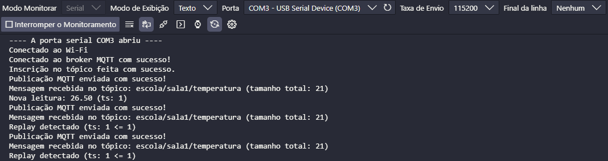
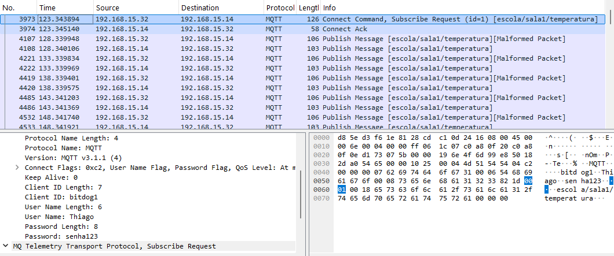
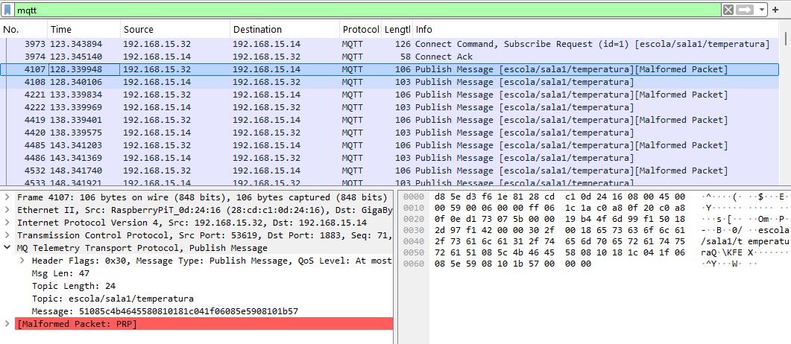
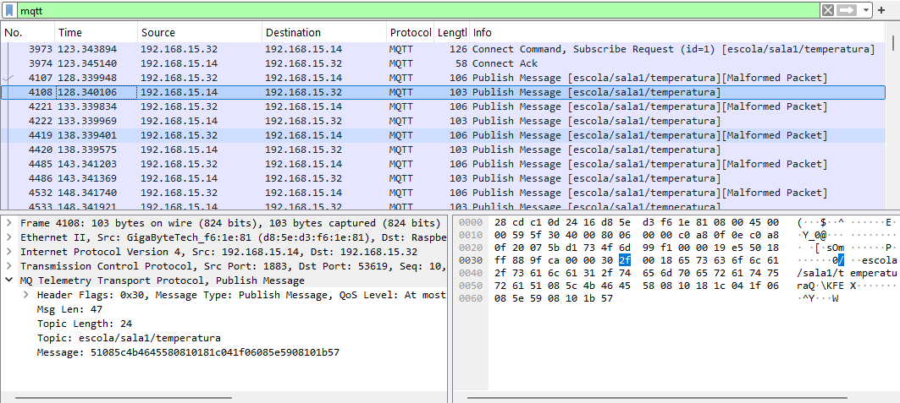
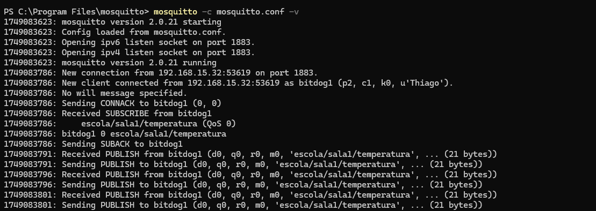

# Tarefa: IoT Security Lab - EmbarcaTech 2025

Autores: Thiago Young de Azevedo e Luan Felipe Azzi

Curso: Residência Tecnológica em Sistemas Embarcados

Instituição: EmbarcaTech - HBr

Campinas, Maio de 2025

# Segurança em IoT com BitDogLab (C/C++)  
## Projeto de Comunicação Segura via MQTT com Raspberry Pi Pico W

### Descrição
Este projeto demonstra uma comunicação segura entre dispositivos IoT utilizando a placa **BitDogLab** com **Raspberry Pi Pico W**, implementada em **C** com o **SDK do Pico** e a biblioteca **lwIP** para MQTT. O foco principal está na **segurança da comunicação**, com autenticação, criptografia leve e proteção contra ataques como *sniffing* e *replay*.

---

### Requisitos

- 2x BitDogLab (com Pico W)
- Mosquitto Broker (instalado e configurado no desktop)
- VSCode com Pico SDK e CMake
- Wireshark (para monitorar os pacotes)
- Conexão Wi-Fi local

---
### Funcionalidades Implementadas

- Conexão à rede Wi-Fi (modo estação – `cyw43_arch`)  
- Comunicação MQTT básica com publicações em tópicos  
- Autenticação simples no broker Mosquitto (usuário e senha)  
- Criptografia leve usando XOR (ofuscação de payload)  
- Proteção contra replay utilizando timestamp nas mensagens  

---

### Testes Realizados

#### Conexão e MQTT
- BitDogLab se conectou com sucesso à rede Wi-Fi local.
- Publicação em tópico `escola/sala1/temperatura` usando `mqtt_publish`.
- Comunicação entre duas placas, sendo uma publisher e outra subscriber utilizando o computador como broker.

#### Segurança
- Broker configurado com autenticação via `mosquitto_passwd`.
- Mensagens ofuscadas com XOR visivelmente cifradas no Wireshark.
- Subscriber validando timestamp para detectar mensagens repetidas (*replay attacks*).

### Exemplo de Teste 

Este teste demonstra a implementação de comunicação segura via MQTT utilizando uma única placa BitDogLab com Raspberry Pi Pico W que atuou simultaneamente como publisher e subscriber, conectando-se a um broker Mosquitto local.

Os prints abaixo apresentam os resultados que foram obtidos executando este teste envolvendo ferramentas como **Wireshark** para vizualizar o envio e recebimento dos dados entre o Broker, o publisher e o subscriber (sendo que, neste caso, o publisher e o subscriber são o mesmo cliente), além do terminal (cmd) utilizado para inicializar o **Broker Mosquitto** e o monitor serial do **VS Code**, para vizualizar as confirmações de publicação e recebimento da mensagem por parte do publisher e subscriber respectivamente.

#### Monitor Serial - VS Code

 

O print acima mostra as mensagens de confirmação quanto: 

- A conexão com o Wi-fi local.
- A conexão estabelecida com o Broker MQTT.
- A inscrição no tópico específico `escola/sala1/temperatura` por parte do subscriber.
- A confirmação da publicação da mensagem neste tópico presente no Broker por parte do publisher.
- A confirmação de recebimento da mensagem no tópico específico por parte do Broker.
- E, por fim, a mensagem de verificação de ataque de replay na qual, como é possível notar neste print, a primeira mensagem é considerada como "Nova leitura", apresentando o valor da temperatura: "26.5" e o timestamp: ts = 1 desta mensagem, porém, a partir da segunda mensagem, já é considerado uma tentativa de replay pois a mesma mensagem com o mesmo conteúdo é enviada a cada 5 segundos, o que leva o sistema a interpretar uma tentativa deste tipo de ataque.

#### Wireshark - Subscribe Request

O print acima apresenta o envio de requisição de inscrição (que está destacado em azul) para o tópico `escola/sala1/temperatura` presente no Broker MQTT. Isso é feito pelo subscriber.

#### Wireshark - Publicação do publisher para o tópico do Broker

O print acima apresenta a publicação da mensagem que foi feita pelo publisher (Bitdoglab) para o Broker. O publisher é representado pelo IP 192.168.15.32 e o Broker é representado pelo IP 192.168.15.14. Na parte mais abaixo da imagem é possível notar que o conteúdo da mensagem (Message) está criptografado e também está apresentado o tópico específico para onde esta mensagem foi enviada (`escola/sala1/temperatura`).

#### Wireshark - Publicação do tópico do Broker para o subscriber

O print acima apresenta a passagem da mensagem do tópico `escola/sala1/temperatura` presente no Broker para o subscriber inscrito neste tópico. Como dito antes, o Broker é representado pelo IP 192.168.15.14 e o subscriber tem o mesmo IP que o publisher por conta deste teste estar usando uma única placa como publicador e inscrito ao mesmo tempo (192.168.15.32).

#### Mosquitto Broker

O print acima mostra uma série de mensagens geradas pelo próprio Broker indicando, por exemplo, a inscrição do subscriber no tópico `escola/sala1/temperatura` onde o subscriber possui o seguinte ID: bitdog1. Além disso, estão apresentadas, de forma alternada, mensagens relacionadas a publicação feita pelo publisher e que é recebida pelo Broker em um tópico específico e mensagens relacionadas ao fato do Broker repassar a mensagem do publisher para o subscriber através do tópico informado anteriormente. No final dessas mensagens, está indicado o tamanho em bytes dos dados publicados pelo publisher.

---

### Discussão e Análise

#### Técnicas Escaláveis

| Técnica                        | Escalável? | Observações |
|-------------------------------|------------|-------------|
| MQTT com autenticação         |    Sim     | Compatível com ambientes reais |
| Criptografia XOR              |    Não     | Somente para fins didáticos |
| Proteção com timestamp        |    Sim     | Requer sincronização mínima |

#### Aplicação em Ambientes Escolares

- Utilizar um **broker central Mosquitto** com autenticação para todas as BitDogLab.
- Atribuir **IDs únicos** para cada dispositivo (`bitdog1`, `bitdog2`, ...).
- Criar uma estrutura de tópicos organizada por sala/laboratório.
- Substituir XOR por uma criptografia mais robusta.
- Criar dashboards web para visualização dos dados em tempo real.

---
### Bibliotecas Utilizadas

| Biblioteca                 | Descrição                                                                 |
|----------------------------|---------------------------------------------------------------------------|
| `<string.h>`               | Funções para manipulação de strings (ex: `strlen`, `memcpy`, `snprintf`) |
| `<time.h>`                 | Geração de timestamp com `time(NULL)` para proteção contra replay         |
| `<stdint.h>`               | Tipos inteiros com tamanho fixo (ex: `uint8_t`, `uint32_t`)               |
| `"pico/stdlib.h"`          | Funções básicas do SDK Pico (GPIO, delays, inicialização de I/O)         |
| `"pico/cyw43_arch.h"`      | Interface para o controle do Wi-Fi no chip CYW43 da Raspberry Pi Pico W  |
| `"include/wifi_conn.h"`    | Header do módulo personalizado para conexão Wi-Fi                        |
| `"include/mqtt_comm.h"`    | Header do módulo de comunicação MQTT                                     |
| `"include/xor_cipher.h"`   | Header da função de criptografia XOR desenvolvida no projeto             |
| `"lwip/apps/mqtt.h"`       | Biblioteca MQTT do lwIP (leve, usada para dispositivos embarcados)       |
| `"lwipopts.h"`             | Arquivo de configuração customizada da pilha lwIP (timeouts, buffers)    |

---
### Referências

- [Documentação Pico SDK - Networking](https://www.raspberrypi.com/documentation/pico-sdk/networking.html)  
- [lwIP MQTT API](https://www.nongnu.org/lwip/2_1_x/group__mqtt.html)  
- [Mosquitto MQTT Broker](https://mosquitto.org/)

---

## 📜 Licença
GNU GPL-3.0.
